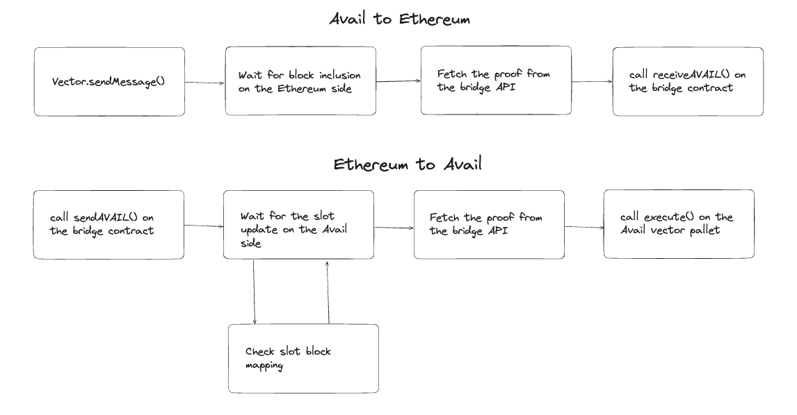

# Avail bridge flow 

# avail-bridge-examples
This repository contains Avail bridge example code which demonstrates various supported operations on the bridge. `example` directory contains the following files:

* `avail_attestation.rs` - contains an example how a DA transaction can be attested on Ethereum.
* `avail_eth_send_msg.rs` - contains an example of arbitrary message bridging from Avail to Ethereum, addressed to a specific contract capable of receiving the message and executing it. A mock contract is supplied which demonstrates the capability, and does nothing with the message
* `avail_eth_token_transfer.rs` - demonstrates sending AVAIL tokens from Avail to Ethereum.
* `eth_avail_send_msg.rs` - demonstrates arbitrary message bridging from Ethereum to Avail.
* `eth_avail_token_transfer.rs` - demonstrates sending AVAIL tokens from Ethereum to Avail.

To use the examples, you need to supply your own account secrets with appropriate balance of Avail and Eth. Additionally, you can specify different network RPC URLs.

After that, you can execute
`cargo run --example <name_of_example>` to run the examples

In folder deno typescript examples can be found:

* `attestation.ts` - contains an example how a DA transaction can be attested on Ethereum.
* `avail_eth.ts` - demonstrates sending AVAIL tokens from Avail to Ethereum.
* `eth_avail.ts` - demonstrates sending AVAIL tokens from Ethereum to Avail.

To run typescript examples:

`deno run -A <name_of_example>.ts` 
